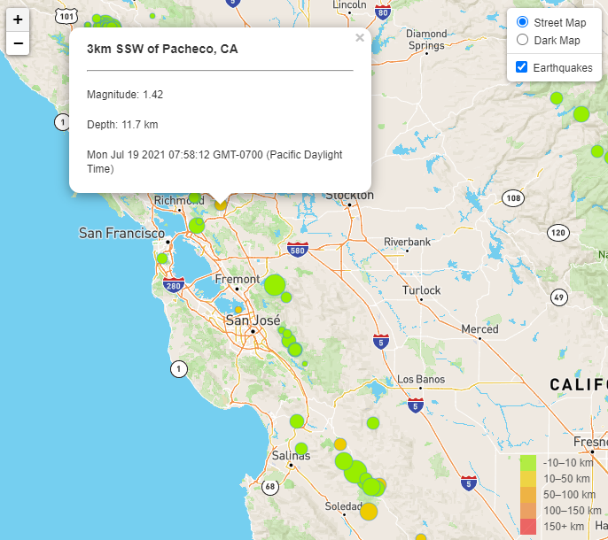

# Leaflet Visualization

In this project, earthquake data is collected from the USGS website via D3.json and displayed through Leaflet GIS. The earthquakes of the last week are presented a dots on the map, with the magnitude relating to the radius of the dot, and the depth of the quake relating to the color. Further functionality is added through data toggles. 
